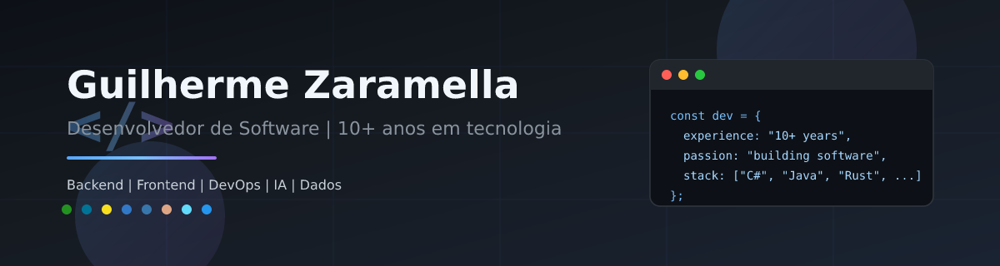

---

## 👋 Sobre mim

Sou **Guilherme Zaramella**, desenvolvedor de software com **mais de 10 anos de experiência** em tecnologia. Minha jornada começou no **hardware** - montagem, manutenção e infraestrutura, antes de migrar para o desenvolvimento, o que me deu uma visão completa: da máquina física ao código que roda nela.

Tudo começou com **C#**, onde me apaixonei por tecnologia e descobri que construir software é transformar ideias em soluções reais. Desde então, evolui por múltiplas linguagens e ecossistemas, sempre com foco em **código limpo, arquitetura sólida e entrega de valor**.

Nos últimos anos, também atuo com **Inteligência Artificial aplicada** — integrando **LLMs** em produtos reais, com domínio do ciclo completo: do prompt ao deploy em produção.

> *"O espaço entre a teoria e a prática não é tão grande como é, a teoria na prática."*

---

## 💼 Experiência

| Área | Destaques |
|------|-----------|
| **Trajetória** | 10+ anos em tecnologia · background em hardware antes do desenvolvimento |
| **Perfil** | Full-stack com forte atuação em backend, APIs, integração de sistemas e IA aplicada |
| **Inteligência Artificial** | LLMs · fine-tuning · system prompts · RAG · vetores em PostgreSQL · governança de IA |
| **Mindset** | Pragmatismo, ownership e melhoria contínua — da concepção ao deploy |
| **Diferencial** | Visão end-to-end: infraestrutura, aplicação, dados, IA e pipeline de entrega |

---

## 🛠 Stack principal

### Linguagens

*C# foi meu ponto de partida - onde tudo começou. Hoje atuo também com Java, JavaScript/TypeScript, Python e, mais recentemente, **Rust**.*

---

### Backend & Frameworks

Experiência sólida com **Node.js** e ecossistema **npm**, incluindo projetos recentes com **NestJS** e **Next.js** para APIs robustas e aplicações modernas.

---

### Frontend

**ReactJS** · **Vite** · **Bootstrap** · **styled-components** · **CSS nativo** · **Redux / Redux-Saga** · **React Context API** · **Zustand**

---

### Inteligência Artificial

Atuo na construção de soluções com **IA generativa** integradas a produtos de software — do desenho da arquitetura à operação em produção.

**Projeto em destaque:** **Smarf Prime** — plataforma com modelos de **LLM** aplicados a contextos de negócio reais.

| Competência | O que faço |
|-------------|------------|
| **Modelos & LLMs** | Integração e orquestração de modelos de linguagem em fluxos de aplicação |
| **Fine-tuning** | Ajuste de modelos para domínios e comportamentos específicos |
| **System prompts** | Engenharia de prompts e instruções de sistema para respostas consistentes |
| **RAG** | Retrieval-Augmented Generation com **vetores em PostgreSQL** (pgvector) |
| **Governança de IA** | Regras, validações, tratamento de respostas e controle de qualidade |

*Não fico só na camada de API — penso em como a IA se comporta, como recupera contexto e como entrega valor de forma confiável.*

---

### Bancos de dados

<table>
<tr>
<td align="center" valign="top" width="50%">

<strong>🗄 Relacionais</strong>

 

</td>
<td align="center" valign="top" width="50%">

<strong>⚡ Não relacionais</strong>

</td>
</tr>
</table>

---

### DevOps & CI/CD

Experiência com **GitHub Actions**, **AWS Amplify**, **Docker**, **docker-compose** e orquestração de **containers** em ambientes de desenvolvimento e produção.

---

## 📊 GitHub Stats

---

## 🧩 Skills em destaque

---

## 🚀 O que busco

Projetos desafiadores onde eu possa aplicar experiência técnica acumulada ao longo de uma década — construindo sistemas **escaláveis**, **maintíveis** e com impacto real, incluindo soluções com **IA aplicada**. Aberto a colaborações, code reviews e conversas sobre arquitetura, boas práticas e engenharia de LLMs.

---

**Obrigado pela visita!** 👾

*Se gostou do perfil, deixe uma ⭐ em algum repositório ou entre em contato.*

